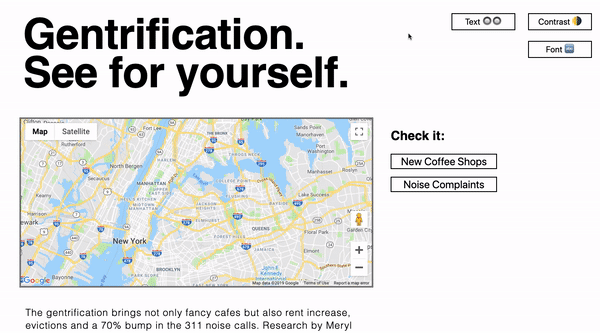

# Gentrification Map

Gentrification Map allows us to see how two New York neighborhoods change. Bushwick is an already-gentrified neighborhood and Southeast Bronx is slowly being gentrified. Data from NYC OpenData allows us to see how many new cafes were open in 2010 vs 2018 and whether that correlates to noise complaints. The underlying assumption is that gentrifiers (usually white hipsters) call 311 on the long-time neighborhood residents. 

Explore:
[Deployed version](https://gentrification-map.firebaseapp.com/) || [Backend repo](https://github.com/sylwiavargas/Gentrification-Heatmap-Backend)



This project was developed as Flatiron School's Mod 3 assignment in JavaScript. It uses vanilla JavaScript for frontendand Rails backend. Maps are fetched from Google API, stat data from local .json files and data from local database. Although primarily the data was to be fetched directly from NYC OpenData, it turned out that the fetched files would be significantly larger and so the data was extracted into local .json.


## Getting Started

These instructions will get you a copy of the project up and running on your local machine for development and testing purposes. See deployment for notes on how to deploy the project on a live system.

### Installing

```
$ git clone
$ cd [repo location]
$ npm install
```

To run:
Go to App.js and uncomment its contents

```
$ npm start
```

## Built With

* [Google Maps Javascript API](https://developers.google.com/maps/documentation/javascript/tutorial)
* Vanilla JavaScript (front-end)
* Rails (back-end)

## Contributing

Please read [CONTRIBUTING.md](https://github.com/sylwiavargas/Gentrification-Map-Frontend/blob/master/CONTRIBUTING.md) for details on our code of conduct, and the process for submitting pull requests to us.

## Authors

* **Sylwia Vargas**
* **Chris Ogilvy** - *Initial work*

## License

This project is licensed under the MIT License - see the [LICENSE.md](LICENSE.md) file for details
